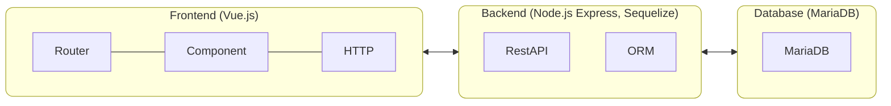

# dbwebviewer

A database web viewer. Frontend implemented with Vue.js and backend implemented with Express and Node.js.

## Local Development

### Requirements

- [Docker Engine / Docker CE](https://docs.docker.com/engine/install/) or [Docker Desktop](https://docs.docker.com/desktop/install/mac-install/)
- Local running database with `docker compose --project-directory ./db up -d`
- [Node.js](https://nodejs.org/en/download)

### Overview



### Backend with Node.js & Express

```ps
cd ./src/backend/
node server.js
```

Check the running server with `(Invoke-WebRequest http://localhost:8082/).RawContent`.

Create an database entry with `(Invoke-WebRequest http://localhost:8082/api/tutorials/ -Method POST -Body '{"title": "Title No. 1", "description": "Lorem ipsum dolor..."}' -ContentType "application/json").RawContent`

Get all items from database with `(Invoke-WebRequest http://localhost:8082/api/tutorials/).RawContent`

### Frontend with Vue.js

```ps
cd ./src/frontend/
npm run serve
```

Access the frontend with `http://localhost:8081/`.

## Debugging

- Check if Docker running with `docker info` and `docker ps`
- Check if database running with `http://localhost:8080/`. Credentials are defined in ./db/docker-compose.yaml and default to username `root` and password `123456`.
